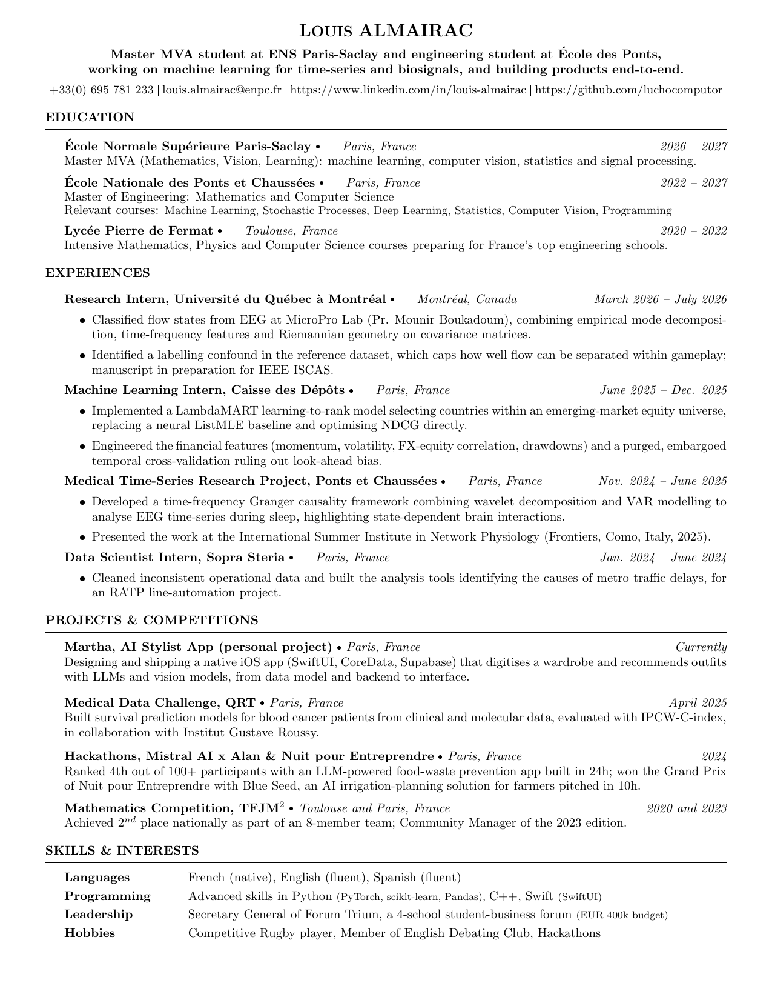

# CV

Louis Almairac — Master MVA (ENS Paris-Saclay) and École des Ponts. Machine learning for time-series and biosignals.

[**Download the PDF**](cv.pdf)

[](cv.pdf)

## Build

`resume.cls` sits next to the source, so a plain compilation is enough:

```sh
pdflatex cv.tex
```

The preview image above is regenerated from the PDF with:

```sh
pdftoppm -png -r 150 -f 1 -l 1 cv.pdf preview && mv preview-1.png cv.png
```
